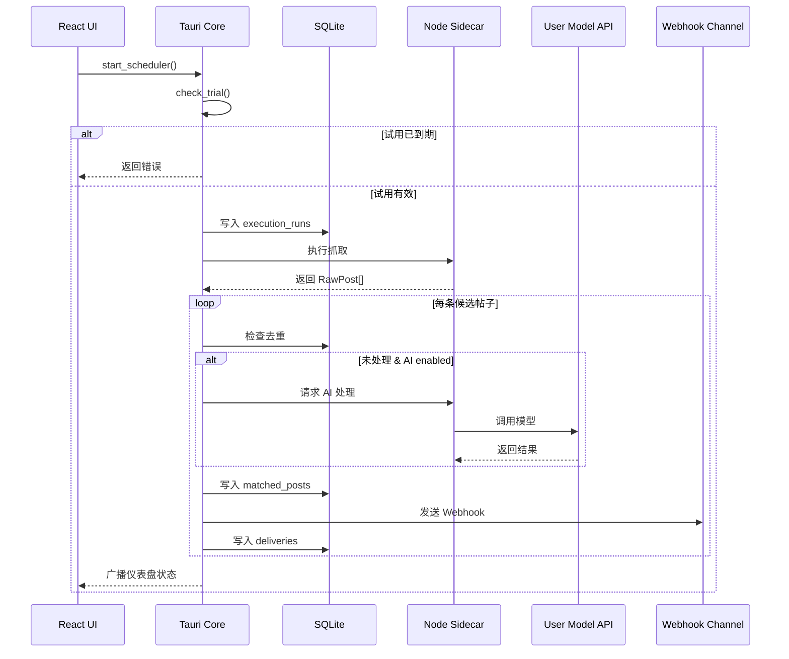

# 架构设计

## 系统架构

系统采用五层结构：

```
┌─────────────────────────────────────────────┐
│           React + TypeScript (UI)           │
├─────────────────────────────────────────────┤
│              Tauri v2 (Rust Core)           │
│   调度器 · SQLite · Keychain · Chrome 管理   │
├─────────────────────────────────────────────┤
│         Node.js Sidecar (浏览器自动化)        │
│   浏览器控制 · 内容提取 · AI 调用 · Webhook  │
└─────────────────────────────────────────────┘
```

1. **桌面端壳** — Tauri + React，负责配置、任务控制、状态展示
2. **本地浏览器 Worker** — Node.js Sidecar + CDP，执行搜索和内容提取
3. **调度与增强核心** — Rust Core，负责调度、去重、日志落库、Webhook 推送
4. **本地数据层** — SQLite + OS Keychain
5. **试用授权控制** — 纯客户端内置过期时间

## 技术栈

| 层级 | 技术栈 |
|---|---|
| 前端 | React 19, TypeScript, Vite, Tailwind CSS, shadcn/ui, Zustand |
| 后端 | Rust, Tauri v2, SQLite (rusqlite), 系统 Keychain (keyring) |
| 浏览器自动化 | Node.js, Chrome DevTools Protocol, WebSocket |
| 构建 | pnpm workspace monorepo, esbuild |

## 核心时序



## 数据结构

### app_config

用户基础配置，包含平台、关键词、业务描述、AI 配置、通知渠道等。API Key 不存入 SQLite，使用系统 Keychain。

### processed_posts

去重表，记录已处理帖子的平台 ID 和首次/最近看到时间。

### execution_runs

执行记录，包含开始/结束时间、状态、扫描数、命中数、推送数、错误摘要。

### matched_posts

命中记录，包含帖子信息、AI 摘要、命中理由、优先级、回复样本。

### deliveries

推送记录，包含渠道、状态、HTTP 响应码。

## Tauri Commands

```
save_config(config) -> Result<(), Error>
get_config() -> Result<AppConfig, Error>
save_api_key(provider, api_key) -> Result<(), Error>
get_trial_status() -> Result<TrialState, Error>
start_scheduler() -> Result<(), Error>
stop_scheduler() -> Result<(), Error>
open_login_window(platform) -> Result<(), Error>
get_dashboard_snapshot() -> Result<DashboardSnapshot, Error>
get_recent_runs(limit) -> Result<Vec<ExecutionRun>, Error>
```

## Sidecar CLI

```bash
# 打开登录窗口
./probe-sidecar login --platform xiaohongshu --profile-dir ~/.local-probe/browser-profile

# 执行一次抓取
./probe-sidecar run --config-json '{...}'
```

API Key 由 Rust Core 从系统密钥链读取后注入运行环境，不通过明文 CLI 参数传递。
